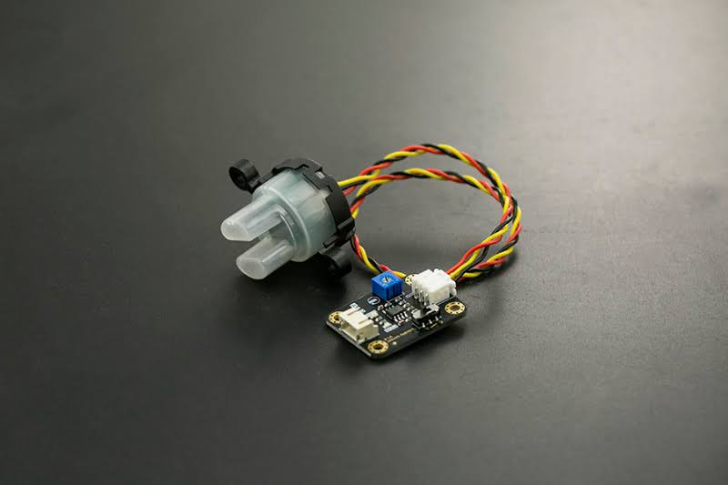

# Lab Notebook

## Entry for September 11, 2024

### Objective
- Met with my team for the first time to review the project: a water-skimming robot designed to detect and collect pollutants from water surfaces.
- Focused on exploring possible designs for the robot and researching water turbidity as a key metric for determining water cleanliness.

### What Was Done
1. Discussed the core goals of our project:
   - The robot should autonomously navigate water surfaces, detect pollutants using turbidity sensors, and collect debris for disposal or analysis.
2. Researched existing water-skimming robots for design inspiration.
   - Found the [Jellyfishbot](https://www.iadys.com/jellyfishbot/), which provided useful insights into possible physical designs and collection mechanisms.
3. Began investigating water turbidity as an indicator of pollution:
   - Discovered that turbidity measures how particles suspended in water scatter light, making it a reliable way to assess water quality.
   - References:
 	- [USGS: Turbidity and Water](https://www.usgs.gov/special-topics/water-science-school/science/turbidity-and-water)
 	- [Waterboards: Turbidity Guidance](https://www.waterboards.ca.gov/water_issues/programs/swamp/docs/cwt/guidance/3150en.pdf)
4. Collaborated with the team on drafting our project approval, due tomorrow (September 12). We focused on clearly presenting the problem, our solution, and the technical approach.

## Entry for September 12, 2024

### Objective
- Wrap up the project approval post that’s due tonight by clearly defining what our robot is supposed to do and making sure all the details are covered.

### What Was Done
1. **Project Approval Post**
   - We finalized the title: *Water-Skimming Robot for Pollution Cleanup*. The project focuses on building a robot that skims water to collect small debris and provides real-time feedback on water quality.
   - The post outlined the key points:
 	- **Problem**: Water pollution from trash, invasive species, and poor waste management is a serious threat to aquatic ecosystems and public health. Current cleanup methods are time-consuming and not efficient.
 	- **Solution**: A small robotic system that uses GPS and sensors to stay in a predefined area, collects debris in a net, and measures water clarity using a turbidity sensor. LEDs (green or red) give instant feedback based on the water’s pollution level.
   - **Subsystems**:
 	- **Motor Control**: We’re using dual brushless DC motors (LICHIFIT RC Jet Boat Underwater Motor Thrusters) to keep the robot moving at a steady pace. These will be controlled by the microcontroller.
 	- **Autonomous Navigation**: A servo motor for steering, guided by a GPS module (NEO-6M) and IMU. This setup will help the robot avoid boundaries and return to the starting point to drop off debris.
 	- **Power**: A 7.4V Zeee battery to power everything, all enclosed in a waterproof case.
 	- **Chassis and Storage**: Lightweight materials (PVC pipes and styrofoam) for the frame, with a plastic net attached to catch debris.
 	- **Sensors**: We will use a turbidity sensor, which measures how cloudy or clear the water is, based on the amount of light scattered by particles suspended in the water. The readings are expressed in NTU (Nephelometric Turbidity Units), a standard measure of water clarity. Lower NTU values mean cleaner water, while higher NTU values indicate pollution or sediment.
   - **Success Criteria**:
 	- The robot can navigate a small body of water (like a pool or a lake) without crossing boundaries.
 	- It collects floating debris and brings it back to the disposal area.
 	- The turbidity sensor correctly triggers the green or red LEDs based on water clarity.

2. **Team Discussions**
   - We talked about how to handle navigation and decided to stick with GPS since image recognition systems often lead to more problems than they solve.
   - Simplified the turbidity sensor feedback system by skipping app-based data transmission and just using the LED indicators instead.

3. **Next Steps**
   - Start finding and ordering parts, especially the turbidity sensor and motor setup.
   - Plan how we’re going to test the robot once it’s ready, including setting up boundaries and debris for a trial run.

## Entry for September 16, 2024

### Objective
- Start putting together the project proposal document due on September 19. The goal was to organize everything we already have and begin drafting new sections like the high-level requirements.

### What Was Done
1. **Setting Up the Proposal**
   - I created the overall layout for the document and added everything we had so far from the project approval. This included details about the problem, solution, and subsystem components, so we had a solid foundation to build on.

2. **High-Level Requirements**
   - We worked as a team to come up with these key goals for the robot:
 	- It needs to autonomously navigate a water source, avoiding both boundaries and any obstacles it might encounter.
 	- It should be able to detect and collect debris of at least a certain size using its net. The robot has to carry and move a minimum amount of weight without messing up its navigation.
 	- It must continuously monitor water clarity with a turbidity sensor, giving real-time feedback through LEDs (green for clean water, red for polluted).
   - While reviewing the navigation system, we realized avoiding just the boundary wasn’t enough—it also needs to handle obstacles. We thought about using computer vision but decided it was way too complicated for what we’re trying to do, so we’ll stick with GPS for now and maybe add simpler sensors for obstacle detection.

3. **Progress on the Document**
   - We finished the basic sections and laid out most of the information we need. Some areas, like defining the size and weight thresholds for debris, still need work.
   - We’re planning to refine everything tomorrow after getting feedback from our TA.

## Entry for September 17, 2024

### Objective
- Meet with our TA, Dongming Liu, to present our progress and get feedback on key project components.

### What Was Done
1. **TA Meeting**
   - We brought the following items to the meeting as required:
 	- A first draft of our block diagram.
 	- The three high-level requirements we developed yesterday:
   	1. Autonomous navigation within a predefined water source, avoiding boundaries and obstacles.
   	2. Detection and collection of debris of a minimum size and weight without disrupting navigation.
   	3. Continuous turbidity monitoring with real-time LED feedback.
 	- One subsystem requirement, focusing on the turbidity sensor and LED feedback system:
   	- The sensor must accurately measure water clarity in NTU, triggering green LEDs for clean water (below 50 NTU) and red LEDs for polluted water (50 NTU or higher).

2. **Feedback from TA**
   - Dongming provided suggestions for refining our high-level requirements, such as making the weight thresholds more specific.
   - He also gave us ideas to improve the block diagram, such as clarifying the interaction between subsystems.

3. **Next Steps**
   - Update the block diagram and refine the high-level requirements based on Dongming's feedback.
   - Work on specifying thresholds for debris collection and incorporate these into the proposal document.

## Entry for September 19, 2024

### Objective
- Finish and submit the project proposal document, making sure all sections are complete and the technical details are solid.

### What Was Done
1. **Proposal Work**
   - I focused on writing and refining a few key sections:
 	- **Problem and Solution**: Expanded on how water pollution is a huge issue and why our robot is a practical, automated way to tackle it. Highlighted the use of GPS for navigation, a net for debris collection, and a turbidity sensor for monitoring water quality.
 	- **Ethics and Safety**: Made sure to emphasize wildlife safety, using sustainable materials, and waterproofing all the electronics to avoid malfunctions. Also covered how we’re sticking to safety standards and regulations.
   - Did more research on turbidity to back up our choice of the [TSD-10 turbidity sensor](https://www.amphenol-sensors.com/hubfs/AAS-920-616C-Thermometrics-TSD-10-022724-web.pdf):
 	- **What It Does**: The TSD-10 measures water clarity by detecting how particles scatter light. It outputs a voltage reading we’ll use to calculate NTU (Nephelometric Turbidity Units), which is the standard for water clarity. NTU gives us a straightforward way to judge if the water is clean (green LED, below 50 NTU) or polluted (red LED, 50 NTU or higher).
   - As a team, we decided to add a reach goal: If we finish early, we’ll try adding a camera to help the robot steer toward debris. It’s ambitious, but it could make the robot more efficient.

2. **Defining My Role**
   - Decided to make turbidity monitoring my main focus for the project. I’ll handle the setup for the TSD-10 sensor, work on the LED feedback system, and make sure we get accurate NTU readings during tests.
   - Told my group I’m happy to help with smaller tasks for the other subsystems when needed.
   - Also, I kind of took on the role of keeping the team organized. I’ll make sure everyone knows when deadlines are coming up and keep communication clear in our chats.

## Entry for September 23, 2024

### Objective
- Submit the team contract after realizing it hadn’t been turned in.

### What Was Done
1. **Team Contract Submission**
   - Noticed we hadn’t submitted the team contract, so I quickly informed my team, and we managed to get it turned in today.
   - The contract includes:
 	- Our project goals, like ensuring the robot can autonomously navigate a water source, collect debris, and monitor water clarity with LED feedback based on turbidity.
 	- Expectations for the team, such as clear communication, punctuality, and sharing work fairly.
 	- A list of tasks broken down by subsystem, covering everything from motor control and sensor integration to building and testing the chassis.
 	- Processes for handling team issues, including in-person discussions and escalation to the TA if needed.

## Entry for September 24, 2024

### Objective
- Meet with our TA to discuss the feedback on our project proposal and figure out what changes we need to make before the regrade.

### What Was Done
1. **TA Feedback**
   - **Proving Feasibility**: The TA mentioned we need some sort of calculation or evidence to prove that our design is feasible. What we have now doesn’t do that. They suggested focusing on power or load—maybe using physics to show that the motor can provide enough torque and power to carry everything.
   - **Visual Aid**: While the TA understands what we’re trying to show, they pointed out the professor might need more clarity. We’ll need to make the visual aid more detailed and easier to follow.
   - **Details**: Some small but important things are missing, like labeling power lines in the diagrams. These need to be added for the regrade.

2. **Next Steps**
   - Add calculations or simulations to prove the motor can handle the expected load.
   - Update the visual aid to make it more clear for someone unfamiliar with the design.
   - Fix any missing details, especially labels on the power lines, to make everything more complete.

## Entry for October 1, 2024

### Objective
- Meet with the TA to review feedback on our submitted proposal and plan next steps for revisions and building the boat.

### What Was Done
1. **TA Feedback on Proposal**
   - **Introduction**:
 	- The Problem and Solution sections are fine as they are.
   - **High-Level Requirements**:
 	- Requirements need adjustment: Accuracy values (e.g., "10 feet" and "12 feet") should be expressed as ranges rather than exact values.
   - **Visual Aid**:
 	- The current visual aid doesn’t clearly show how the system’s components interact. We need to revise this to make the relationships and flow of the system clearer.
   - **Design**:
 	- **Block Diagram**:
   	- Arrows and labels need to be more consistent, particularly for power lines and signal flows.
   	- Consider adding a legend to differentiate signals, voltages, and other connections.
 	- **Subsystem Requirements**:
   	- Some requirements are vague and need quantification:
     	- "Servomotor must be able to turn in water instantaneously" — What does "instantaneously" mean? 1 second, 100 ms, or 10 ms?
     	- "LED light must be able to instantaneously display a red light" — Same question as above.
 	- **Tolerance Analysis**:
   	- Missing load calculations. We need to determine if the motors can handle the expected weight and provide evidence through calculations or simulations.
   - **Ethics and Safety**:
 	- No references were included, and no specific regulation guidelines were mentioned. These need to be added.

2. **Machine Shop Planning**
   - We discussed meeting with the machine shop soon to figure out the physical build of the boat.
   - Decided to prepare a detailed drawing or CAD model before the meeting to ensure productive discussions.

3. **Next Steps**
   - Address all feedback and submit the revised proposal before the regrade deadline.
   - Begin work on the design document, incorporating the TA’s suggestions for clarity and precision.
   - Schedule a meeting with the machine shop as soon as the CAD model or drawing is ready.

## Entry for October 2, 2024

### Objective
- Review options for building the boat based on input from the machine shop and make a decision on materials.

### What Was Done
1. **Machine Shop Discussion**
   - DJ spoke with the machine shop and shared the options they gave us for building the boat:
 	- The design will consist of two pontoons connected by a bridge where the electronics will be housed.
 	- Motors will be attached to the ends of the pontoons for propulsion.
   - The main decision revolves around the material for the pontoons:
 	- **Foam**: Lightweight and easy to shape but has a downside—it can break apart over time and would need to be sealed on the outside to avoid creating debris.
 	- **PVC Pipes**: Durable and already waterproof but slightly heavier than foam.

2. **Team Decision**
   - After discussing the pros and cons, we decided to go with **PVC pipes** for the pontoons:
 	- They’re less likely to break down and cause pollution, which aligns better with the environmental goals of our project.
 	- Foam seemed like too much hassle, especially with sealing and cleanup.

3. **Next Steps**
   - On Friday, we’ll meet with the machine shop again once we have the weight and dimension specifics finalized. This will help us confirm if PVC is still the best choice and if it works with the rest of the design.

## Entry for October 3, 2024

### Objective
- Complete the design document due tonight, focusing on the Requirements and Verification tables and contributing to the turbidity subsystem section.

### What Was Done
1. **Design Document**
   - I organized the document using the provided example format, setting up sections like the introduction, block diagram, and subsystem overviews.
   - Created the **Requirements and Verification (R&V) Tables** to outline measurable goals and how we’ll verify each subsystem.

2. **Turbidity Subsystem Contribution**
   - My primary focus was the **Turbidity Monitoring Subsystem**, where I selected components, performed calculations, and planned verification methods.

   #### Sensor Selection:
   - I chose the **DFRobot SEN0189 turbidity sensor** because:
 	- It’s affordable, fitting within our $150 project budget.
 	- It’s compatible with our microcontroller and straightforward to integrate.
 	- It measures turbidity by detecting how suspended particles scatter infrared light, outputting an analog voltage that corresponds to turbidity levels.
   - Additionally, there is no universal NTU equation or sensor that fits all applications. Different turbidity sensors often use their own calibration methods and scales, so I focused on using the DFRobot sensor and its corresponding calibration approach to ensure accuracy within our specific setup.

   #### Equations and Calibration:
   - To process the sensor’s raw output, I used the following equations:
 	- First, convert the sensor’s analog reading to voltage:
   	V = Analog Value * (5.0 * 1024)
 	- Use the Hakimi study’s equation to calculate NTU:
   	NTU = (4.0769 - V) / 0.0012
 	- **Why I Used the Hakimi Study**:
   	- Commercial NTU calibration solutions cost over $100, which would have blown our budget.
   	- The Hakimi study provided a validated equation specifically for the SEN0189 sensor. This equation was derived from testing water mixed with flour to simulate specific turbidity levels, creating an inexpensive way to map voltage to NTU.
   	- By referencing this study, I ensured our system could calculate NTU accurately without purchasing costly calibration kits.

   #### Turbidity References:
   - To ensure I fully understood the concept of turbidity and its measurement, I referenced the following:
 	- [USGS: Turbidity and Water](https://www.usgs.gov/special-topics/water-science-school/science/turbidity-and-water): Provided foundational knowledge about turbidity and its impact on water quality.
 	- [Waterboards: Turbidity Guidance](https://www.waterboards.ca.gov/water_issues/programs/swamp/docs/cwt/guidance/3150en.pdf): Offered insight into how turbidity is measured and reported in real-world scenarios.
 	- [Hakimi and Jamil (2019)](https://www.amphenol-sensors.com/hubfs/AAS-920-616C-Thermometrics-TSD-10-022724-web.pdf): Supplied the specific NTU equation for the SEN0189 sensor, which I used to calibrate our measurements.

   #### LED Feedback:
   - I selected **ultra-bright green and orange LEDs** from the ECE supply center because:
 	- They were easily accessible and cost-effective.
 	- Their brightness ensures they are visible even in outdoor testing conditions.
 	- The green LED signals clean water (NTU < 50), and the orange LED signals polluted water (NTU ≥ 50).
   - The microcontroller processes turbidity data every 5 seconds and updates the LEDs to reflect the water quality.

   #### Verification:
   - I proposed the following methods in the R&V table to verify the turbidity subsystem:
 	- Use flour solutions to simulate specific NTU levels (e.g., 0, 45, and 55 NTU) and verify sensor readings are within ±10 NTU.
 	- Ensure the LEDs switch states within 5 seconds of crossing the 50 NTU threshold.
 	- Test LED visibility in daylight to confirm usability during outdoor operation.

3. **Role Clarification**
   - I’ve taken ownership of the turbidity monitoring subsystem, handling everything from sensor setup and calibration to LED integration and testing. This will be my main contribution to the project.

#### DFRobot Sensor

## Entry for October 4, 2024

### Objective
- Fix and finalize the regrade project proposal based on the feedback we got from our TA, making sure everything is ready for resubmission.

### What Was Done
1. **Proposal Revisions**
   - I went through the TA’s notes and made the following updates:
 	- **Added Missing References**:
   	- Included proper citations for the turbidity sensor (Hakimi study), the USGS turbidity guide, and the California Water Boards guide.
 	- **Clarified High-Level Requirements**:
   	- Replaced fixed accuracy values like "10 feet" and "12 feet" with ranges to better account for real-world variations.
 	- **Improved the Visual Aid**:
   	- DJ cleaned up the block diagram by labeling all power lines and adding a legend to show what different arrows mean for signals and voltages. It looks a lot clearer now.
 	- **Quantified Vague Terms**:
   	- Defined what "instantaneously" means for the servo motor and LED system, adding specific times (e.g., "under 3 seconds" or "100 ms") so it’s measurable.
 	- **Expanded Tolerance Analysis**:
   	- Our group added calculations to show that the motors can handle the expected load and that the steering system will perform within our defined tolerances. Used basic physics to back up these claims.
  

## Entry for October 7, 2024

### Objective
- Meet with Gregg Bennett at the machine shop to discuss the feasibility of our boat design and plan the next steps for fabrication.

### What Was Done
1. **Machine Shop Meeting**
   - We presented our boat design, including the 3D models of the chassis and key components (pontoons, bridge, motors, and turbidity sensor placement).
   - Gregg confirmed that the machine shop could fabricate the design, which was a big relief for the team.

2. **Next Steps from the Machine Shop**
   - Gregg requested that we provide all parts and detailed documentation as soon as possible. This will allow the shop to measure and fit everything appropriately during fabrication.
   - Specifically, we’ll need to include:
 	- Dimensions for critical components, such as the turbidity sensor and motors.
 	- Any updated design files or CAD models if changes are made.

3. **Team Action Plan**
   - Collect and organize the parts we’ve already ordered.
   - Confirm exact dimensions for components like the turbidity sensor and send those measurements, along with the CAD models, to Gregg later this week.

## Entry for October 12, 2024

### Objective
- Purchase all necessary parts for the project based on the design document.

### What Was Done
- I ordered all the parts listed in the design document for the team, ensuring we have everything needed for the build. This included components like the turbidity sensor, motors, LED indicators, and the microcontroller. 

## Entry for October 15, 2024

### Objective
- Meet with TA to review the PCB design before submitting it for ordering.

### What Was Done
- Presented the PCB design to our TA for feedback. The goal was to ensure it met all requirements and was ready to be ordered.
- Received approval to move forward with the order.

## Entry for October 22, 2024

### Objective
- Address the missing motor issue and decide on a replacement. Plan next steps based on feedback from the TA.

### What Was Done
1. **Motor Issue**
   - The group met with TA Dongming while I was traveling. They confirmed that the motors we originally ordered didn’t ship and that we couldn’t order the Alomejorcho4up3tw1-11 motor due to it being a third-party item.
   - After discussion, we decided on this replacement motor: [QX Motor - 12V-16V Brush Underwater Propeller Motor](https://www.qx-motor.net/products/12v-16v-brush-underwater-propeller-motor-for-unmanned-nesting-trawler-remote-control-duck-boat).
   - I placed an order for two of these motors to keep the project on track.

2. **Coding Reminder**
   - Dongming emphasized that we should start working on the coding aspect of the project soon. I need to start testing the turbidity sensor soon since it may need to be calibrated, and that will require lots of testing.

## Entry for October 25, 2024

### Objective
- Begin assembling the circuit for the project using the KiCad schematic as a guide.

### What Was Done
1. **Circuit Assembly**
   - We worked on connecting the **IMU**, **GPS module**, **button**, and **LEDs** to the microcontroller.
   - The LEDs required additional resistors because feeding them directly with 5V would have exceeded their voltage rating.

2. **Next Steps**
   - Continue working on connecting all subsystems with the parts that we currently have in order to be able to test their functionality.

## Entry for October 28, 2024

### Objective
- Test and verify the IMU, GPS, button, and LEDs on the breadboarded prototype.

### What Was Done
1. **Progress**
   - Successfully connected the **IMU**, **GPS module**, **button**, and **LEDs** to the microcontroller on our breadboard.
   - Verified that all components are interfacing correctly using a test script.

2. **Testing Code**
   - Used the following script to:
 	- Read GPS data and display live latitude/longitude in the Serial Monitor.
 	- Collect accelerometer, gyroscope, and magnetometer data from the IMU.
 	- Blink two LEDs at different intervals for testing output pins.
 	- Debounce the button input and log when it’s pressed.

3. **Observations**
   - The LEDs blinked at the correct intervals, confirming they were wired properly.
   - The GPS provided accurate location data when the module had a clear signal.
   - The IMU successfully output accelerometer, gyroscope, and magnetometer readings, verifying its functionality.
   - The button responded accurately, and debouncing logic worked to eliminate multiple signals from a single press.

4. **Next Steps**
   - Connect and test the turbidity sensor, battery, and ESCs.
   - Begin integrating the components with the control logic for motor outputs.
   - Test the accuracy of the GPS and IMU.

## Entry for November 2, 2024

### Objective
- Begin preparation for testing the turbidity sensor by creating solutions with known NTU values and understanding how to convert analog readings into NTU.

### What Was Done
1. **Material Acquisition**
   - To prepare for testing, I purchased:
 	- **Distilled water** from Target as the base for creating test solutions.
 	- **Flour**, which will act as the particle source to create varying turbidity levels. Flour particles scatter light effectively, simulating real-world turbidity in water.

2. **Turbidity Sensor Code and Calibration**
   - I used the sample code from the DFRobot website to read the sensor's analog output and convert it to a voltage. Here’s how it works:
 	- The sensor outputs a raw analog signal, which our Arduino converts to a voltage using this formula:
   	V = Analog Value * (5.0 * 1024)
 	- The sample code prints the calculated voltage to the Serial Monitor every 500 ms, allowing me to monitor the sensor's output in real-time.

   - To convert the voltage to NTU, I referenced the calibration graph from the Hakimi and Jamil study. The graph provides a linear relationship between voltage and turbidity, represented by this equation:
 	NTU = (4.0769 - V) / 0.0012
 	- This equation maps the voltage to an NTU value, where lower voltage corresponds to higher turbidity (cloudier water), and higher voltage corresponds to clearer water.
 	- The equation is based on experimental data from the study, which used controlled turbidity solutions to establish the relationship.

3. **Testing Challenges**
   - **Water in the Lab**:
 	- I’m uncertain if water is allowed in the lab, which complicates where I can test the turbidity sensor. I’ll need to check with the TA since I don’t want to take the project home where it won’t allow my group to work on it.
   - **Solution Storage**:
 	- I don’t have proper containers for storing the test solutions. My initial idea is to use **plastic Ziploc bags** because they’re inexpensive, flexible, and sealable. However, I’ll need to consider potential issues like inconsistent mixing affecting measurements.

4. **Next Steps**
   - Check if water testing is allowed in the lab or find another location.
   - Finalize a method for storing test solutions—potentially moving to plastic jars or cups if Ziploc bags prove unsuitable.
   - Begin with baseline testing using:
 	- **Distilled water (0 NTU)** as a reference.
 	- Mixtures of distilled water and flour to simulate specific NTU levels (e.g., 20 NTU, 60 NTU).
   - Write additional code to log sensor data over time and validate the sensor's response to different turbidity levels.

## Entry for November 5, 2024

### Objective
- Purchase additional connectors and adaptors needed to connect the battery, ESCs, and PCB

### What Was Done
- I ordered three **XT60 female surface-mount connectors** for DJ to integrate the battery connection directly with our PCB. These connectors are crucial for creating a secure, reliable interface between the power source and the board.
- Additionally, I purchased two **Venom Power XT60 Male to Tamiya Female Adapters with 14AWG wire.**

### Why This Was Needed
- The XT60 connectors are necessary to properly attach the power system to the PCB. Without these, we’d risk unreliable connections or potential damage to the board during operation.
- The Venom Power adaptors simplify the setup between the battery and ESCs by eliminating the need for soldering.

### Next Steps
- Once the parts arrive, I’ll bring them to DJ so he can solder the XT60 connectors onto the PCB and test the connections with the battery.

## Entry for November 7, 2024

### Objective
- Test the turbidity sensor to verify that it outputs the correct voltage for a 0 NTU solution (distilled water).

### What Was Done
- Connected the turbidity sensor to the breadboard and powered it through the 5V from the microcontroller.
- Used the sample code from the DFRobot website to read the sensor’s analog output and convert it to a voltage.

### Observations
- The sensor did not behave as expected:
  - For the 0 NTU solution (distilled water), the output was around **4.2 V**, which is accurate. For a ~1400 NTU solution I also tested, I found a strange reading around **3.3 V**.
  - These values are outside the expected range for the ~1400 NTU calibration, which should be closer to 2.3 V based on the sensor documentation.
- I believe the sensor might not be properly connected or there is an issue with the wiring.

### Next Steps
1. Double-check the sensor connections:
   - Ensure the power (5V) and ground are securely connected to the appropriate pins on the sensor.
   - Verify that the signal is properly connected to the correct analog input pin on the microcontroller.
2. Use a multimeter to measure the sensor’s output voltage directly at the pin to confirm if the issue is with the sensor itself or the wiring.
3. Review the code and hardware setup.

## Entry for November 8, 2024

### Objective
- Complete the revision of the design document.

### What Was Done
- Made all necessary updates based on the TA’s feedback:
  - Fixed missing title.
  - Added IEEE format in-text citations.
  - Added captions.
- Finalized the document and submitted it.

## Entry for November 10, 2024

### Objective
- Pick up the connectors and deliver them to the team.

### What Was Done
- Collected the **XT60 female surface-mount connectors** and **Venom Power XT60 Male to Tamiya Female Adapters** I ordered earlier.
- Dropped them off in the team locker.

## Entry for November 11, 2024

### Objective
- Help DJ in troubleshooting the ESC and battery issue.

### What Was Done
- Worked with DJ to diagnose why the ESC was blinking red.
  - Suspected low voltage protection or calibration issues.
- Couldn’t resolve the problem so I will need to investigate it again soon.

## Entry for November 14, 2024

### Objective
- Keep testing the ESC to figure out why the motor wasn’t working consistently.

### What Was Done
- I tested the motor with the ESC, and it worked, but not reliably. It seemed like something wasn’t triggering properly.
- After I left, DJ figured out the issue:
  - The ESC needs a signal lower than zero throttle (below 90) for a couple of seconds to turn on.
  - This means we’ll need to program a delay when the boat starts up. During this time, the user can press a button to activate the ESC while we send the negative throttle signal.
- Emailed the machine shop with the dimensions of the turbidity sensor so they could start designing its attachment for the boat.

### Next Steps
- Add the startup delay to the code and retest the ESC and motor to make sure it works every time.

## Entry for November 19, 2024

### Objective
- Test the LED code and troubleshoot the turbidity sensor’s inconsistent readings.

### What Was Done
- Tested the LED code in the lab to confirm it’s working as expected.
- Figured out the issue with the turbidity sensor:
  - The sensor wasn’t plugged in properly, which was causing the inconsistent voltage readings.
  - I found this by checking the DFRobot website, where it’s listed as a common issue with this sensor.
- Verified that the sensor now outputs consistent voltages for 0 NTU. The NTU readings need to be calibrated since they are negative.
- Next step for the sensor is calibration:
  - The Hakimi study recommends calibrating the equation for our specific setup, so I’ll start working on that next.

### Next Steps
- Begin the calibration process for the turbidity sensor equation using test solutions.
- Test the LED feedback system with the turbidity sensor to ensure everything integrates smoothly.

## Entry for November 27, 2024

### Objective
- Continue turbidity sensor testing and calibration.

### What Was Done
- Wrote the code for testing the turbidity.
- Prepared 250 mL solutions for 0 NTU, 25 NTU, 50 NTU, and 100 NTU using distilled water and flour, following the formula from the Hakimi study:
  - Used the equation:
	TSS (g/L) = (NTU + 58.985) / 379.04
	- Converted the resulting TSS into grams of flour for 250 mL by scaling down appropriately.

#### Final Measurements for Each Solution:
  - **0 NTU**: Pure distilled water, no flour added.
  - **25 NTU**: 0.06 g of flour.
  - **50 NTU**: 0.07 g of flour.
  - **100 NTU**: 0.10 g of flour.

- Mixed the solutions thoroughly. Allowed the mixtures to settle slightly to reduce inconsistencies during testing.

### Testing Procedure
- Connected the turbidity sensor to the breadboard/Arduino and measured its output for each solution.
  - Used the DFRobot-provided sample code to convert analog readings into voltage.
  - Averaged the voltage readings over a 5-minute period for each solution to reduce noise and account for fluctuations.
- Applied the Hakimi voltage-to-NTU conversion equation:
  NTU = (4.0769 - V) / 0.0012
 -  During testing, I noticed the sensor's NTU value for the 0 NTU solution was reading as **-88 NTU**. To account for this, I adjusted the NTU equation by adding an offset of **+88**, ensuring the readings aligned with expected values for proper calibration.
 - Verified that the measured NTU values aligned with the expected results based on the prepared solutions.
 - Observed the correct LEDs turning on based on the NTU being <50, or >= 50.

### Challenges
- **Fluctuations**: Observed variability in sensor readings due to temperature changes and mixing inconsistencies.
- **Testing Setup**: Worked around lab restrictions by testing at home using new plastic containers to store the solutions.

### Next Steps
- Use the calibrated sensor to test that the full system works.

## Entry for November 30, 2024

### Objective
- Finalize data collection and analyze post-calibration results for the turbidity sensor.

### Post-Calibration Results
#### Voltage Shifts
- Observed a slight decrease in voltage readings compared to initial calibration:
  - **0 NTU**: ~4.13V (previously 4.18V)
  - **25 NTU**: ~4.10V (previously 4.15V)
  - **50 NTU**: ~4.07V (previously 4.12V)
  - **100 NTU**: ~4.02V (previously 4.06V)
- The consistent ~0.03V decrease per 25 NTU remained, validating the relative accuracy of the sensor.

#### NTU Ranges
- Calculated NTU values based on updated voltages:
  - **0 NTU**: 38.38 to 44.06 NTU
  - **25 NTU**: 59.98 to 67.31 NTU
  - **50 NTU**: 85.80 to 101.80 NTU
  - **100 NTU**: 135.04 to 148.65 NTU

### Observations
- **Shift in NTU Values**: The 0 NTU solution averaged around 40 NTU rather than 0, likely due to:
  - Temperature changes with the sensor.
  - Mixing inconsistencies in solutions.
  - Residue or interference on the sensor during testing.
- Despite the upward shift in absolute NTU values, the relative differences (~0.03V per 25 NTU) were consistent. This confirms that the sensor is calibrated effectively for detecting relative changes in turbidity.

### Conclusion
- The turbidity sensor meets the project’s ±10 NTU requirement for grading.

## Entry for December 1, 2024

### Objective
- Help DJ debug the Node.js web server simulation and figure out the next steps for testing.

### What Was Done
- I visited Mattis Park in Savoy to see if we could test on the lake, but the lake was frozen solid, so outdoor testing wasn’t an option.
- Worked with DJ to get the Node.js web server simulation running. While I managed to get the simulation working on my computer, the boat wasn’t visually updating in the simulation.
  - The issue was that both motors needed power, but since we don’t have the PCB yet, we could only connect the battery to one motor.
- Decided this will need to be debugged in the lab with DJ or Malay, since we can use lab equipment to plug in 7.4V to the other motor.
- Recorded proof of the boat net carrying over 250g of weight in my bathtub, fulfilling the R&V for the storage system.

### Next Steps
- Plan a time to go to the lab and debug the motor issue with the team.
- Keep an eye on the weather to see if we’ll get another chance for outdoor testing soon.

## Entry for December 2, 2024

### Objective
- Debug the simulation in the lab and prepare for the demo.

### What Was Done
- Malay and I went to the lab to work on debugging the simulation and getting the hardware ready:
  - Successfully got both motors working and our simulation visually updated the position of the boat while it moved.
  - We picked up our final PCB order and Malay helped with the soldering.
  - Spent a few hours debugging an issue where the boat wasn’t entering the "return to base" state in the simulation. Malay is continuing to work on this with DJ.
- After debugging, I checked the lake again to see if outdoor testing was possible, but it’s still frozen.
- Started preparing my turbidity data and the working turbidity system for the demo tomorrow.

### Next Steps
- Finalize my turbidity presentation and ensure the system is ready for tomorrow’s demo.
- Follow up with DJ and Malay to check on the status of the simulation debugging.

## Entry for December 3, 2024

### Objective
- Demo the project and showcase individual subsystems.

### What Was Done
- Successfully demonstrated my fully functional turbidity subsystem, showing how it accurately measures and displays turbidity levels with the LED feedback system.
- Unfortunately, the entire boat couldn’t be tested on a lake due to frozen weather conditions.
- Encountered issues with the PCB not functioning as expected, which limited the demo of the full system.
- Started preparing our presentation to talk through our entire project next week.

### Next Steps
- Talk with the team to finalize the presentation.
- Reflect on subsystem performance and improvements to discuss during the presentation.

## Entry for December 6, 2024

### Objective
- Deliver the mock presentation and take notes for improvement.

### What Was Done
- Presented the project, including the turbidity subsystem.
- Feedback included:
  - Add more details about turbidity.
  - Pay more attention to teammates during the presentation.
  - Increase font size.

### Next Steps
- Update the slides with more turbidity information and adjust font size.
- Rehearse with the team to improve the flow of our presentation.

## Entry for December 9, 2024

### Objective
- Prepare for the final presentation by rehearsing our slides.

### What Was Done
- Added my turbidity data and relevant details about how the subsystem works to the presentation.
- Briefly rehearsed the updated presentation with the team.

### Next Steps
- Finalize the presentation and do a full rehearsal before the final demo.

## Entry for December 10, 2024

### Objective
- Present the final project demo.

### What Was Done
- Practiced our presentation before the demo time.
- Delivered the final demo.

### Next Steps
- Write our Final Report due tomorrow.

## Entry for December 11, 2024

### Objective
- Complete the final project report.

### What Was Done
- Wrote the final report, pulling references and content from previous project documents:
  - Design document
  - Individual progress report
  - Presentation slides
  - Additional team notes and data
- Made sure all sections were consistent and cited relevant sources appropriately.

### Next Steps
- Complete the Lab checkout tomorrow.

## Entry for December 12, 2024

### Objective
- Complete the lab checkout process.

### What Was Done
- Checked out of the lab, returning all equipment and cleaning up the workspace.

### Next Steps
- Turn in my journal.
